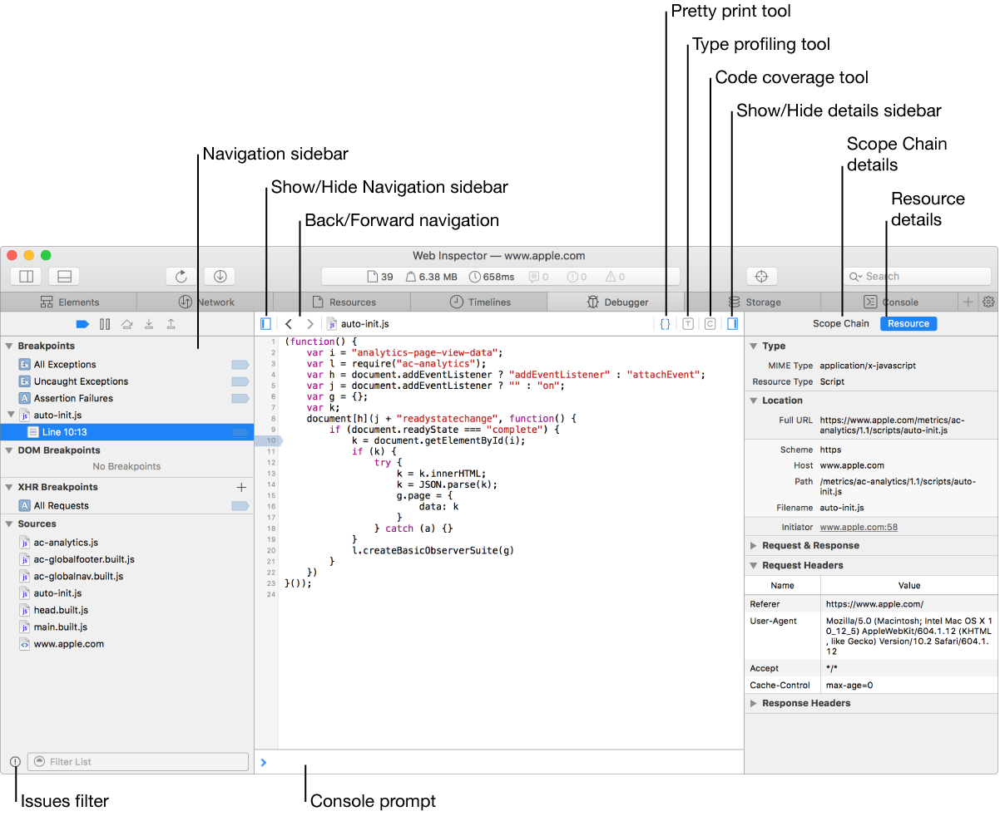

# JavaScript Bugs and Errors

### table of contents

1.  [bugs & debugging](##-bugs-&-debugging) 
2.  [javascript makes debugging hard]()
3.  [errors that javascript does complain about]()
4.  [strict mode]()
5.  [types]()
6.  [testing]()
7.  [debugging with `console.log`]()
8.  [debugging with browser debugger]()
9.  [exception handling]()
10. [assertions]()
11. [summary]()
12. [in-class problem]()

## bugs & debugging 

1 of 12

 > Debugging is twice as hard as writing the code in the first place. Therefore, if you write the code as cleverly as possible, you are, by definition, not smart enough to debug it."
 >
 > – Brian Kernighan and P.J. Plauger, The Elements of Programming Style

 Flaws in computer programs are usually called bugs and the process of finding mistakes - bugs - in programs is called debugging.  
 

 ## javascript makes debugging hard

 JavaScript's looseness makes debugging hard.  Its concept of bindings and properties is vague enough that it will rarely catch typos before actually running the program.  And even then, it allows you to do some clearly nonsensical things without complaint, such as computing: `true * "monkey"`.  Often, your nonsense computation will merely produce NaN (not a number) or an undefined value, which the program happily continues, convinced that it's doing something meaningful.  The mistake will manifest itself only later, after the bogus value has traveled through several functions.  It might not trigger an error at all but silently cause the program's output to be wrong.  Finding the source of such problems can be difficult.  Fortunately, JavaScript does have some tools to help.
 ## errors that javascript does complain about

 1.  Syntax errors
- writing a program that does not follow javascript's syntax will immediately make the computer complain.

 2.  Other things that will cause an error to be reported when the program tries to perform the action include:
- calling something that's not a function
- looking up a property on an undefined value

## strict mode

JavaScript can be made a little stricter by enabling <span style="color:orange;">`strict mode`</span>.  This is done by putting the string `"use strict"` at the top of the file or a function body.

```JavaScript
function canYouSpotTheProblem () {
    "use strict";
    for (counter = 0; counter < 10; counter++) {
        console.log("Happy happy");
    }
}
canYouSpotTheProblem();
// -> ReferenceError:  counter is not defined
```

Normally, you forget to put let in front of your binding, as with counter.

Putting a few strategic `console.log` calls into the program is a good way to get additional information about what the program is doing.  Printing the content of variables is an effective way to debug in any language.  The following example program tries to convert a whole number to a string in a given base.


## types

- some languages want to know the types of all your bindings and expressions before even running a program.
- they will tell you right away when a type is used in an inconsistent way.
- JavaScript considers types only when actually running the program, and even then often tries to implicitly convert values to the type it expects, so it's not much help.
- Still, types provide a useful framework for talking about programs.
- A lot of mistakes come from being confused about the kind of value that goes into or comes out of a function.
- If you have that information writtten down however, you're less likely to get confused.
- You could add a comment like the following to describe its type:

```JavaScript
// (state, memory) -> {stat: string, memory: Array}
function goalOrientedRobot(state, memory) {
	//...
}
```

There are a number of different conventions for annottaing JavaScript programs with types.

## testing

Computers are good at repetitive tasks, and testing is the ideal repetitive task.  Automated testing is the process of writing a program that tests another program.  Writing tests is a bit more work than testing manually.  But once you've done it, it takes only a few seconds to verify that your program still behaves proeprtly in all the situation you wrote tests for.  Tests usually take the form of little labeled programs that verify some aspect of your code.  For example, a set of tets for the toUpperCase method might look like this...

```JavaScript
fuction test(labe, body) {
	if (!body()) {
		console.log(`Failed: ${label}`);
	}
}

test("convert Latin text to uppercase", () => {
	return "hello".toUpperCase() == "HELLO";
});
```

## debugging with `console.log`

Putting a few strategic `console.log` calls into the program is a good way to get additional information about what the program is doing.  Printing the content of variables is an effective way to debug in any language.  The following example program tries to convert a whole number to a string in a given base (decimal, binary, and so on) by repeatedly picking out the last digit and then dividing the number to get rid of this digit.  But the strange output that it currently produces suggests that it has a bug.

```JavaScript

/*
 * @author	Morgan Bergen
 * @date 	Sun Oct 23 13:37:37 CDT 2022
 * @brief 	convert whole number to a string in a given base
 * @name	convertToBase
 */


function numberToString(n, base = 10) {
	let result = "";
	let sign = "";

	if (n < 0) {
		sign = "-";
		n = -n;
	}

	do {
		result = String(n % base) + result;
		n /= base;
	} while (n > 0);

	return (sign + result);
}

console.log(numberToString(13, 10));

```

## debugging with browser debugger

An alternative to using `console.log` to peek into the program's behavior is to use the debugger capabilities of your browser.  Browsers come with the ability to set a breakpoint on a specific line of your code.  When the execution of the program reaches a line with a breakpoint, it is paused, and you can inspect the values of bindings at that point.  Debuggers differ rom browser to browser, but look in your browser's developer tools to learn more.  Another way to set a breakpoint is to include a `debugger` statement (consisting of simply that keyword) in your program.  If the developer tools of your browser are active, the program will pause whenever it reaches such a statment.   



## exception handling


When a function cannot proceed any longer...
.. what we would like to do is just stop what we are doing and immediately jump to a place that knows how to handle the problem.  This is what exception handling does.  Exceptions are a mechanism that makes it possible for code that runs into a problem to throw an exception:

Throwing an exception causes the program to stop what it is doing and immediately jump to a place that knows how to handle the problem.  Jumping to the place that knows how to handle the problem is called catching the exception.  The `throw` keyword is used to throw an excpetion.  Catching one is done by wrapping a piece of code in a try catch block, followed by the keyword `catch`.  When the code in the try block causes an exception to be raised, the catch block is evaluated, with the name in parentheses bound to the exception value.  After the `catch` block finishes or if the `try` block finishs without any raised problems the program beneath the try catch statement proceeds.

```JavaScript
/*
 * @author      Morgan Bergen
 * @date        Sun Oct 23 14:23:25 CDT 2022
 * @brief       exception handling example
 * @file        error.js
 */


function promptDirection(question) {
        let result = prompt(question);

        if (result.toLowerCase() == "left") return "L";
        if (result.toLowerCase() == "right") return "R";

        throw new Error("Invalid direction: " + result);
}

function look() {
        if (promptDirection("Which way?") == "L") {
                return "a house";
        } else {
                return "two angry bears";
        }
}

try {
        console.log("You see", look());
} catch (error) {
        console.log("Something went wrong: " + error);
}
```


# assertions

Assertions are checks inside programs that verify that something is the way it should be.  They are intended to find programmer driven mistakes, not to handle situations that come up as edge cases in normal situations.  Some languages such as Python or C++ allow assertions to be used during debugging and turned off once the compiler or intrepreter once the program is error free.  JavaScript does not support assertions per se, however they can be manually added into code. For example firstElement is a function that should never be called on an empty array.

So instead of silently returning undefined which is the return value you recieve when you try to read an array property that DNE.  Using the new Error() will loudly blow up your program if you misuse it.  Which makes mistakes less likely to go unnoticed and much easier to find them when they do occur.  

```JavaScript

function firstElement(array) {

	if (array.length == 0) {
		throw new Error("empty array");
	}

	return (array[0]);
}

try {
	firstElement([]);
} catch (error) {
	console.log("error caught: " + error.message);
}

```

## summary

- Flaws in computer programs are usually called bugs.
- The process of finding mistakes—bugs—in programs is called debugging.
- JavaScript’s looseness makes debugging hard.
- JavaScript does complain about:
	– Syntax errors
	– Calling something that’s not a function
	– Looking up a property on an undefined value
- JavaScript can be made a little stricter by enabling strict mode.
- Writing test programs is a way to verify that your program still behaves properly in
- Printing out values of key variables with console.log is an effective means of debugging.
- Using the debugger capabilities of your browser is an alternative to using console.log to peek into the program’s behavior.
- Exception handling with the keywords throw, try, and catch causes the program to stop what it is doing and immediately jump to a place that knows how to handle the problem.
- The keywords throw, try, and catch can be used to implement assertions in JavaScript.

## in-class problem

What is the console output of this program, if you type:
1. Left
2. RIGHT
3. UP
4. List in order the statements executed by JavaScript for No. 1 above.
5. List in order the statements executed by JavaScript for No. 2 above.
6. List in order the statements executed by JavaScript for No. 3 above.


```JavaScript
function promptDirection(question) {
	let answer = prompt(question);
	if (answer.toLowerCase() == "left") return "L"; 
	if (answer.toLowerCase() == "right") return "R";
	throw new Error("Invalid answer: " + answer);
}

function look() {
	if (promptDirection("Which way?") == "L") {
		return "a house"; } else {
	}  

	return "two angry bears";
}

try {
	console.log("You see", look());
} catch (error) {
	console.log("something is not right: " + error);
}
```


What is the console output of this program, if you type:

**1.  Left**

`// → You see "a house"`

**2.  RIGHT**

`// → You see "two angry bears"`

**3.  UP**

`// → Something went wrong: Error: Invalid direction: UP`

**4.  List in order the statements executed by JavaScript for No. 1 above**

In order for the interpreter to execute all of the code...

`look()`

`promptDirection()`

`toLowerCase() == left`

`promptDirection() == "L"`

 gets called in order to return...

`// → You see "a house"`

**5.  List in order the statements executed by JavaScript for No. 2 above**


In order for the interpreter to execute all of the code...

`look()`

`promptDirection()`

`toLowerCase() == right`

`else {} / promptDirection() != "L"`

 gets called in order to return...

`// → You see "two angry bears"`

**6.  List in order the statements executed by JavaScript for No. 3 above**

In order for the interpreter to execute all of the code...

`look()`

`promptDirection()`

`Something went wrong: Error: Invalid direction: UP`

 gets called in order to return...

`// → Something went wrong: Error: Invalid direction: UP`
